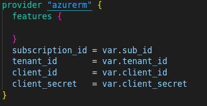

# Generic AKS Deployment Template

This repository contains a generic template for deploying a Private or Public Azure Kubernetes Service (AKS) using Infrastructure as Code (IaC) principles. This template can be customized to suit specific project requirements.

## Resources will be created as per the choice of the user
### For Private AKS
- Resource groups
- Networking: VNET,Subnets.
- AKS cluster
- Virtual machine

### For Public AKS 
- Resource groups
- Networking: VNET,Subnets.
- AKS cluster
  

## Prerequisites

Before using this template, ensure you have the following prerequisites:

    Azure subscription: You need an active Azure subscription to deploy resources.
    Azure CLI or Azure PowerShell: Install and set up Azure CLI or Azure PowerShell on your local machine.
    Terraform: Make sure to have Terraform installed on your local machine
    Optional: Docker and Kubernetes knowledge: Understanding Docker and Kubernetes concepts is beneficial but not mandatory.
## Instructions 

1. Clone the repository:
   
    ```
   git clone https://github.com/NashTech-Labs/generic_aks_template.git
    ```
2. Add the necessary changes

   In provider.tf present in the template folder as you can see there are 4 variable declared you have to pass their values in the variable.tf file for the authentication purpose and you can also configure detials regarding the resources you want to add by adding the values in the variable.tf file
   
   

3. Terraform Init
   
  Before initialization, configure your backend to a remote state. For Azure, we use blob storage to store the Terraform tfstate file. Enter the credentials for your account so that you can authenticate it for your respective Azure account. Add your details in the config.tfbackend file.
   ```
   terraform init -backend-config=config.tfbackend

   ```
4. Terraform Plan
   
   If you want to spin up a private AKS, you can just plan it as by default it will be creating a private AKS. For a public AKS, change the variable: 'private_cluster_enabled=false'.
  
    ```
    terraform plan -var private_cluster_enabled=false  #(for public aks)
    terraform plan  # (for private aks)
    ```

5. Terraform Apply
   
   After reviewing all the resources that are going to be created from the Terraform plan, you can proceed with the execution.
   
   ```
   terraform apply -var private_cluster_enabled=false  # for public AKS
   terraform apply  # for private AKS
   ```

5. Terraform Destory

   If you want to destroy the infrastructure, you can use the following command:
   
    ```
    terraform destroy
    ```
  
